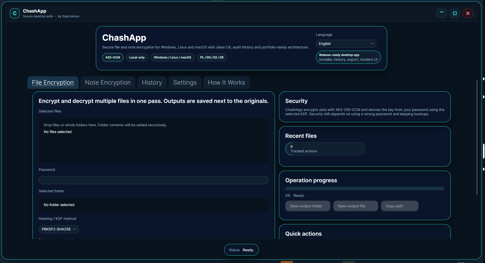
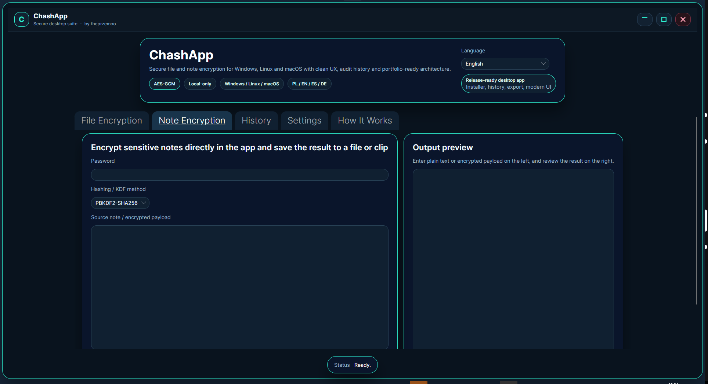
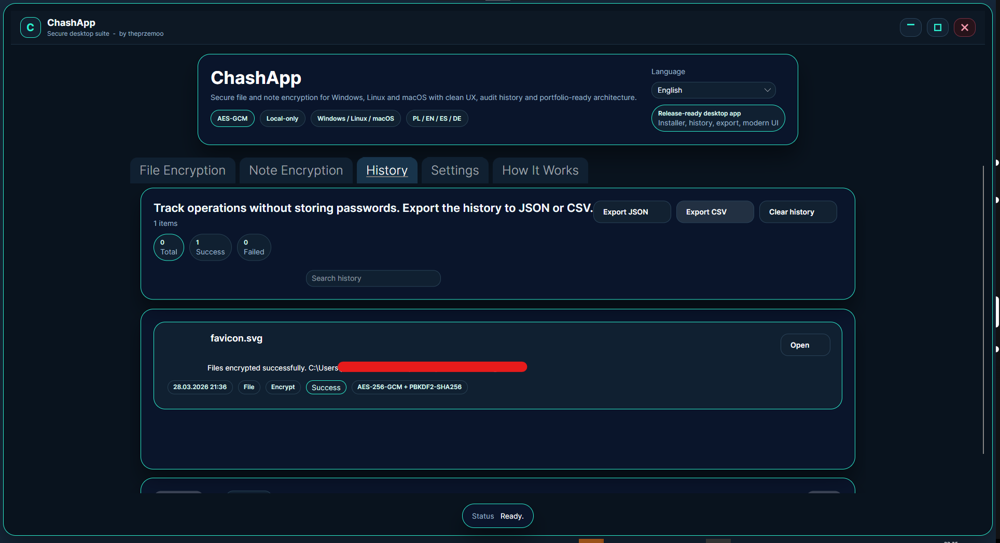
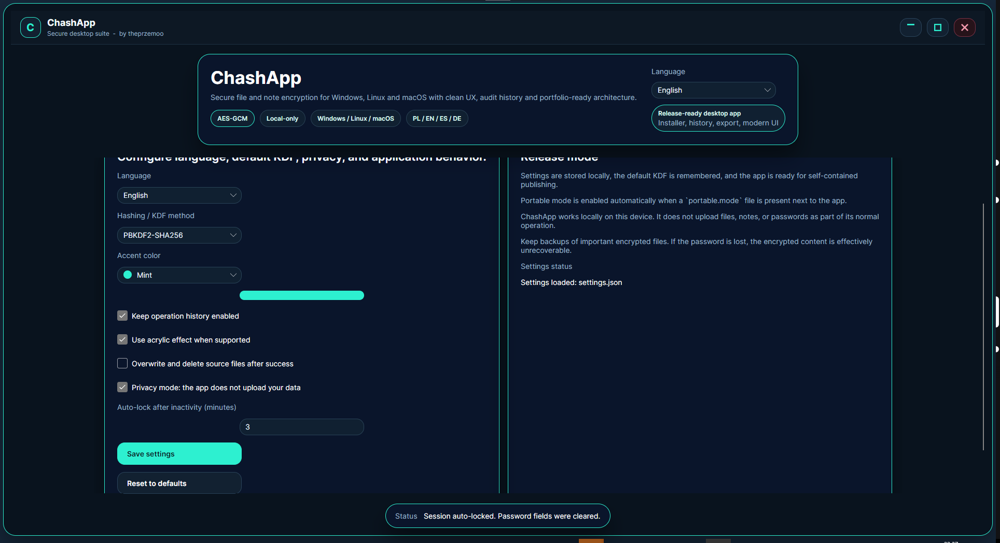

# ChashApp

Modern desktop encryption app built with **C#** and **Avalonia UI**.

ChashApp lets you encrypt **files, folders, and notes** with a clean dark interface, multilingual UI, operation history, export tools, CLI support, and a Windows installer. The project was built as a portfolio-ready desktop product with real publish, packaging, and release flow.



## Overview

ChashApp focuses on practical local encryption:

- encrypt and decrypt files with a user password
- encrypt a whole folder into a single `.chash` container
- encrypt and decrypt notes directly inside the app
- verify encrypted containers
- export operation history to JSON or CSV
- publish and package the app like a real desktop product

The app targets **Windows, Linux, and macOS**.  
The current UI supports **English, Polish, Spanish, and German**.

## Features

- AES-256-GCM encryption
- PBKDF2-SHA256, PBKDF2-SHA512, and Argon2id
- file, folder, and note encryption
- drag and drop support
- secure erase flow
- operation history with search and pagination
- recent files and quick actions
- CLI commands: `encrypt`, `decrypt`, `verify`
- portable mode support
- Windows installer with uninstall flow
- multilingual interface
- tests, smoke tests, benchmarks, publish scripts, and release workflow

## Screenshots

### Main UI


### Note Encryption



### History



### Settings



Static preview asset:

- `docs/chashapp-preview.svg`

Branding reference:

- `docs/brand-guide.md`

## Tech Stack

- C#
- .NET 9
- Avalonia UI
- AES-256-GCM
- PBKDF2 / Argon2id
- xUnit
- Inno Setup

## Project Structure

```text
ChashApp/
├─ .github/                    # CI / release workflow
├─ benchmarks/                 # benchmark project
├─ docs/                       # preview, branding, release notes
├─ installer/                  # Inno Setup script and assets
├─ publish/                    # publish scripts
├─ src/
│  └─ ChashApp/                # main desktop application
├─ tests/
│  └─ ChashApp.Tests/          # unit and UI smoke tests
├─ .gitignore
├─ ChashApp.sln
├─ global.json
└─ README.md
```

## Run Locally

### Visual Studio / Rider

1. Install **.NET 9 SDK**
2. Open `ChashApp.sln`
3. Restore packages
4. Run the `ChashApp` project

### CLI

```bash
dotnet run --project src/ChashApp/ChashApp.csproj -- encrypt sample.txt "ExamplePassword123!" argon2id
dotnet run --project src/ChashApp/ChashApp.csproj -- decrypt sample.txt.chash "ExamplePassword123!"
dotnet run --project src/ChashApp/ChashApp.csproj -- verify sample.txt.chash "ExamplePassword123!"
```

## Windows Build Flow

```powershell
dotnet test .\tests\ChashApp.Tests\ChashApp.Tests.csproj
.\publish\publish-win-x64.ps1
.\installer\build-installer.ps1
```

Published app:

- `artifacts\publish\win-x64\ChashApp.exe`

Installer:

- `artifacts\installer\ChashApp-Setup.exe`

## Publish Scripts

### Windows

```powershell
.\publish\publish-win-x64.ps1
```

### Linux

```powershell
.\publish\publish-linux-x64.ps1
```

### macOS

```powershell
.\publish\publish-osx-arm64.ps1
```

## Installer

After publishing the Windows build:

```powershell
.\installer\build-installer.ps1
```

The installer supports:

- desktop install flow
- uninstall flow
- Start Menu shortcuts
- `.chash` file association for the current user

## Testing

```powershell
dotnet test .\tests\ChashApp.Tests\ChashApp.Tests.csproj
```

Benchmarks:

```powershell
dotnet run -c Release --project .\benchmarks\ChashApp.Benchmarks\ChashApp.Benchmarks.csproj
```

## Security Notes

- encryption is based on **AES-256-GCM**
- key material is derived from the user password
- supported KDF options are **PBKDF2-SHA256**, **PBKDF2-SHA512**, and **Argon2id**
- files and notes are processed locally
- history does **not** store passwords
- lost passwords cannot be recovered
- secure erase reduces simple recovery risk, but should not be treated as an absolute guarantee on every drive or filesystem

## Portfolio Positioning

ChashApp is best presented as:

- a polished desktop portfolio project
- a practical local encryption tool
- a solid base for future commercial hardening

It should **not** be presented as a certified enterprise security product without further hardening, signing, and deeper validation.

## What To Put On GitHub

You should commit:

- `src/`
- `tests/`
- `benchmarks/`
- `installer/`
- `publish/`
- `docs/`
- `.github/`
- `.gitignore`
- `ChashApp.sln`
- `global.json`
- `README.md`

You should **not** commit:

- `artifacts/`
- `bin/`
- `obj/`
- generated installer `.exe`
- generated publish folders
- local history export files
- temporary or personal test files

## Recommended Repository Setup

Repository name:

- `ChashApp`

Short description:

- `Modern desktop encryption app built in C# and Avalonia UI with installer, history, CLI support, and multilingual interface.`

Suggested GitHub topics:

- `csharp`
- `dotnet`
- `avalonia`
- `desktop-app`
- `encryption`
- `aes`
- `argon2`
- `installer`
- `winforms-alternative`
- `portfolio-project`
